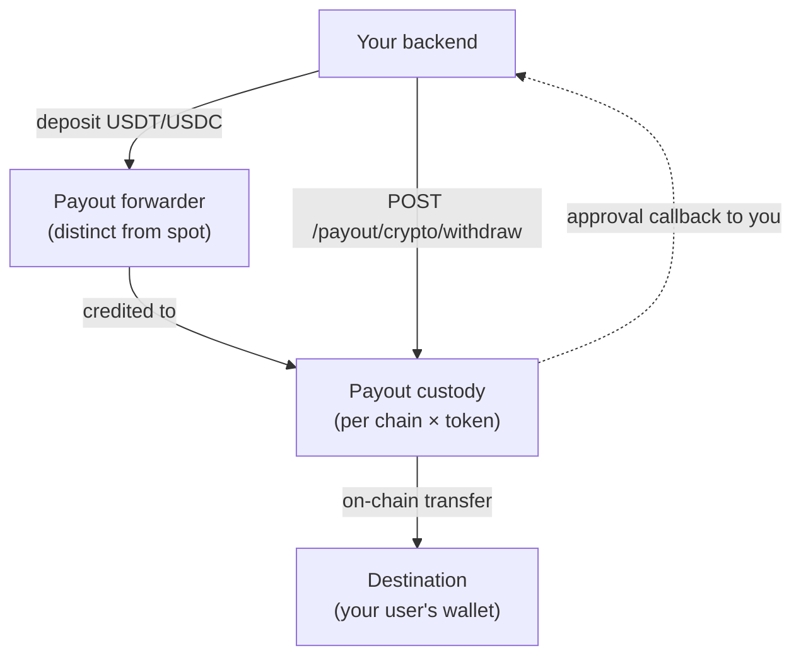

Partner Payout Custody is a **second** wallet behind your merchant account
that's intentionally **walled off** from the spot/skin-buying pipeline. You
deposit USDT or USDC; we hold it; you instruct withdrawals to any EVM
address. Useful when you want to use SkinShark as the crypto rail for your
own user payouts without commingling funds with skin-trading flows.

## Mental model



## Hard constraints

<Warning>
**Withdrawals are per (chain, token), not from a single pool.** SkinShark
holds no cross-chain liquidity. If you deposit USDC on Base, you can only
withdraw it on Base — not Ethereum, not Arbitrum. Each (chain, tokenAddress)
is an independent bucket. Use [`GET /payout/crypto/balances`](/api-reference/endpoint/getPayoutCryptoBalances)
to see what's available where.
</Warning>

<Warning>
The withdrawal endpoint is **API-key only**. The read endpoints
(`/address`, `/balances`, `/withdraw/quote`, list, detail) accept JWT
too so the merchant dashboard can show state, but submitting a withdrawal
must come from your backend.
</Warning>

## Prerequisites

1. **Feature flag.** Your merchant account needs `cryptoPayoutEnabled: true`
   (admin-controlled). Without it, all `/payout/crypto/*` endpoints return
   `1820 CRYPTO_PAYOUT_NOT_ENABLED`.
2. **Callback URL registered.** At least one active `CallbackUrl` on your
   merchant — this is where the approval callback and lifecycle events land.
   Use the dashboard's Webhooks tab.
3. **Webhook secret registered.** Approval callbacks and lifecycle events are
   signed the same way as every other event ([Webhooks](/guides/webhooks)).
   Verify them.

## Setup

### 1. Allocate the payout forwarder

```http
GET /user/wallet/payout/crypto/address
api-key: sk_live_...
```

Returns a CREATE2-derived EVM address valid on all supported chains.
**This address is distinct from your spot deposit forwarder.** Sending
funds to the spot forwarder credits your spot wallet (and funds skin
buys); sending to the payout forwarder credits your partner custody.
Don't confuse them.

```json
{
  "address": "0x6b3a...c41e",
  "chains": ["ethereum", "base", "arbitrum", "optimism", "bsc"],
  "tokens": ["USDT", "USDC"]
}
```

### 2. Fund the address

Send USDT or USDC on any supported chain. Once confirmed:

- A `payout_credit` ledger transaction is posted.
- The corresponding per-(chain, token) sidecar row is incremented.
- We emit `payout.crypto.deposit.completed` to your callback URL.

There's a $1 minimum per deposit (gas-aware floor — below this we don't
credit because the sweep economics break down).

### 3. List balances

```http
GET /user/wallet/payout/crypto/balances
```

```json
{
  "balances": [
    { "chain": "base", "token": "USDC", "tokenAddress": "0x833589fc...", "balanceCents": "1024750" },
    { "chain": "ethereum", "token": "USDC", "tokenAddress": "0xa0b86991...", "balanceCents": "0" }
  ]
}
```

`balanceCents` is USD cents as a bigint string. One row per chain × token
combination you've ever deposited to.

## Withdrawing

### Preview the fee first

The withdrawal fee is `liveGasPrice × multiplier` (multiplier is 1.5×
by default, admin-configurable). On L2 chains the fee is 0.

```http
POST /user/wallet/payout/crypto/withdraw/quote
Content-Type: application/json

{ "chain": "ethereum", "token": "USDC", "amountCents": "100000" }
```

```json
{
  "chain": "ethereum",
  "token": "USDC",
  "amountCents": "100000",
  "feeMultiplier": 1.5,
  "liveFeeUsdCents": "247",
  "liveTotalDebitCents": "100247",
  "stats24h": {
    "minFeeUsdCents": "92",
    "p25FeeUsdCents": "139",
    "avgFeeUsdCents": "219",
    "p75FeeUsdCents": "276",
    "maxFeeUsdCents": "640"
  },
  "computedAt": "2026-05-18T12:34:56.789Z"
}
```

The `stats24h` block lets you decide whether *now* is a cheap moment vs
typical. Quote is advisory — no state mutated.

### Submit the withdrawal

<Note>
**Requires API key** (`api-key` header). JWT auth is rejected on this one
endpoint. This is the only mutating action in the payout group.
</Note>

```http
POST /user/wallet/payout/crypto/withdraw
api-key: sk_live_...
Content-Type: application/json

{
  "chain": "ethereum",
  "token": "USDC",
  "destination": "0xRECIPIENT...",
  "amountCents": "100000",
  "externalId": "payout-2026-05-18-001",
  "forSubUser": "your-end-user-id",
  "maxFeeUsdCents": "500"
}
```

| Field | Notes |
|---|---|
| `chain`, `token` | The bucket you're drawing from. Must match a sidecar row with enough balance. |
| `destination` | Any valid EVM address. Cannot be your own forwarder or the SkinShark treasury. |
| `amountCents` | USD cents to send to `destination`. Fee is added on top. |
| `externalId` | **Required.** Your idempotency key. Must be unique per merchant. We echo this back in the approval callback so you can match against your records. |
| `forSubUser` | **Optional label.** Sub-user UUID or your `externalId` for them. Funds always come from your merchant custody — this just tags the withdrawal for your audit/reporting. |
| `maxFeeUsdCents` | **Optional cap.** If live fee exceeds this, returns `1821` and nothing happens. |

Response:

```json
{
  "id": "8a3f...",
  "status": "pending_callback",
  "chain": "ethereum",
  "token": "USDC",
  "destination": "0xrecipient...",
  "amountCents": "100000",
  "feeCents": "247",
  "externalId": "payout-2026-05-18-001",
  "forUserId": "uuid-of-sub-user",
  "forUserExternalId": "your-end-user-id",
  "createdAt": "2026-05-18T12:34:57.123Z"
}
```

The withdrawal is now `pending_callback` — funds debited from your sidecar
+ a `payout_withdraw_lock` ledger entry posted — and we're about to ping
your callback URL.

## The approval callback (the 2FA gate)

Within ~1 second of accepting your `/withdraw` request, our worker POSTs
to your registered callback URL:

```json
{
  "event": "payout.crypto.withdraw.approval",
  "withdrawalId": "8a3f...",
  "externalId": "payout-2026-05-18-001",
  "forUserId": "uuid-of-sub-user",
  "forUserExternalId": "your-end-user-id",
  "chain": "ethereum",
  "token": "USDC",
  "tokenAddress": "0xa0b86991...",
  "destination": "0xrecipient...",
  "amountCents": "100000",
  "feeUsdCents": "247",
  "createdAt": "2026-05-18T12:34:57.123Z",
  "nonce": "uuid"
}
```

**Signature:** same `webhook-id` / `webhook-timestamp` / `webhook-signature`
scheme as every other event. Verify on the raw body.

**Your job:** look up `externalId` in your records. Confirm you created
this withdrawal with these exact parameters. Return:

- **2xx within 5 seconds** → withdrawal proceeds to `queued` → `broadcast` → `confirmed`.
- **4xx** → withdrawal is immediately refunded. Sidecar restored. `payout_withdraw_refund` ledger entry posted.
- **5xx / timeout / network error** → we retry up to 3 times with backoff. After the 3rd attempt fails, refund.

This is your hard authentication boundary. Treat it like a 2FA prompt.

### Example handler

```ts
import express from "express";
import { verifyWebhook, isError } from "@skinshark/sdk";

app.post(
  "/webhooks/skinshark",
  express.raw({ type: "application/json" }),
  async (req, res) => {
    let event;
    try {
      event = verifyWebhook(req.body, req.headers, { secret: SECRET });
    } catch (e) {
      if (isError(e, "INVALID_SIGNATURE")) return res.status(401).end();
      throw e;
    }

    if (event.event === "payout.crypto.withdraw.approval") {
      const ourRecord = await db.payouts.findUnique({
        where: { externalId: event.externalId },
      });
      if (!ourRecord) return res.status(404).end();   // unknown → refund
      if (
        ourRecord.destination.toLowerCase() !== event.destination.toLowerCase() ||
        ourRecord.amountCents !== event.amountCents ||
        ourRecord.chain !== event.chain ||
        ourRecord.token !== event.token
      ) {
        return res.status(400).end();                 // mismatch → refund
      }
      return res.status(200).end();                   // authorize
    }

    // ... other events (lifecycle, deposit.completed)
    return res.status(200).end();
  },
);
```

## Lifecycle events

After approval (or rejection), you get standard signed webhooks for the
lifecycle:

| Event | Fired when | Carries |
|---|---|---|
| `payout.crypto.deposit.completed` | A deposit credited your payout custody | `deposit` object |
| `payout.crypto.withdraw.broadcast` | On-chain transaction submitted | `withdrawal` with `txHash` |
| `payout.crypto.withdraw.confirmed` | Final confirmation reached | `withdrawal` with `txHash` |
| `payout.crypto.withdraw.failed` | Approval rejected or broadcast permanently failed | `withdrawal` with `failureReason` |
| `payout.crypto.withdraw.refunded` | Sidecar re-credited; paired with `failed` | `withdrawal` |

These follow the **standard** webhook delivery rules from
[Webhooks](/guides/webhooks): 11 retries over ~15h, auto-disable on 72h
continuous failure, signed with your webhook secret.

The synchronous `approval` callback is the **odd one out** — it does **not**
go through this queue. See the Webhooks guide for the comparison table.

## Polling status as a fallback

If you'd rather poll than rely on webhooks (or want to double-check):

```http
GET /user/wallet/payout/crypto/withdrawals/{id}
GET /user/wallet/payout/crypto/withdrawals?status=broadcast&chain=ethereum&limit=50
```

The list endpoint supports cursor pagination, plus filtering by `status`,
`chain`, and `forUserId` (the resolved sub-user UUID — not the externalId
you supplied at create).

## Edge cases

- **Insufficient (chain, token) balance.** Returns `1822` *before* any state
  is touched. Per-(chain, token) sidecar gating; no draws from other chains.
- **Live fee exceeds your `maxFeeUsdCents`.** Returns `1821`. Nothing locked,
  no callback fired. Submit again when gas drops.
- **Duplicate `externalId`.** Returns `1824`. Pick a new value. Idempotency
  on this key is by design — re-submitting the same `externalId` is **not**
  retried, it's rejected so you can detect bugs in your dispatcher.
- **Callback URL missing or all disabled.** Returns `1823` at submit time.
  Re-register a URL, then submit.
- **`forSubUser` doesn't exist or isn't yours.** Returns `1825`. The lookup
  is scoped to your `parentId` — you can only tag your own children.
- **Sub-user suspended / soft-deleted.** Allowed. `forUserId` is a label, not
  an auth scope — the withdrawal still goes through.
- **Reorg reverses a payout deposit.** Pre-existing pipeline gap; we don't
  currently issue reversal postings on reorg. Track this in the SkinShark
  admin treasury views and reach out if it affects you.

## Verification checklist

After integrating, run these against the testnet:

1. Allocate the payout forwarder. Confirm it differs from `/deposit/crypto/address`.
2. Send testnet USDC. Watch for `payout.crypto.deposit.completed` and a sidecar row.
3. Submit to the spot forwarder simultaneously — confirm that one credits the
   spot wallet, not the payout custody. (Routing is by which forwarder
   received funds — the flag never re-routes in-flight deposits.)
4. Quote → withdraw with a mock callback returning 200. Status progresses
   `queued → broadcast → confirmed`. Tx visible at destination.
5. Quote → withdraw with a mock callback returning 403. After 3 retries:
   `failed` + `refunded`, sidecar restored, payout wallet balance restored.
6. Re-submit the same `externalId` → `1824`.
7. `maxFeeUsdCents: "1"` → `1821`.
8. `amountCents` larger than your (chain, token) balance → `1822`.
